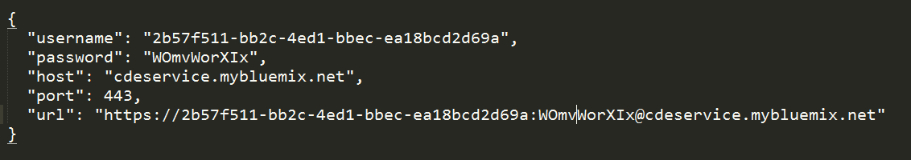
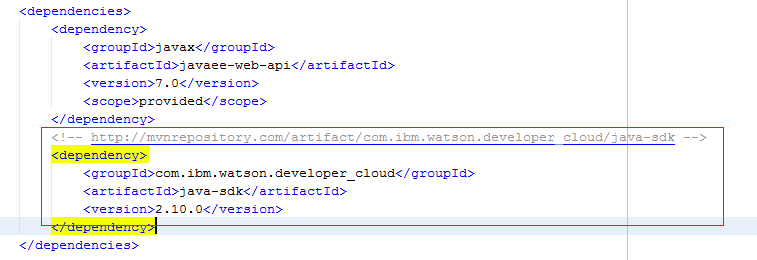
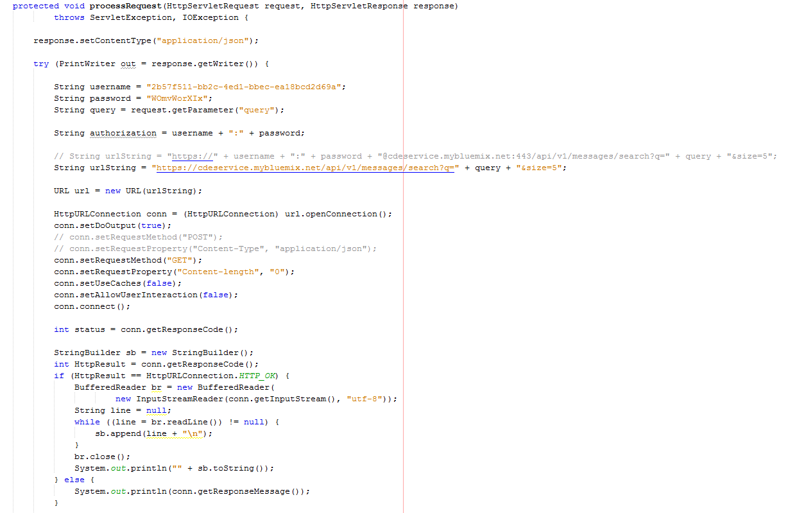
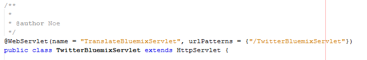
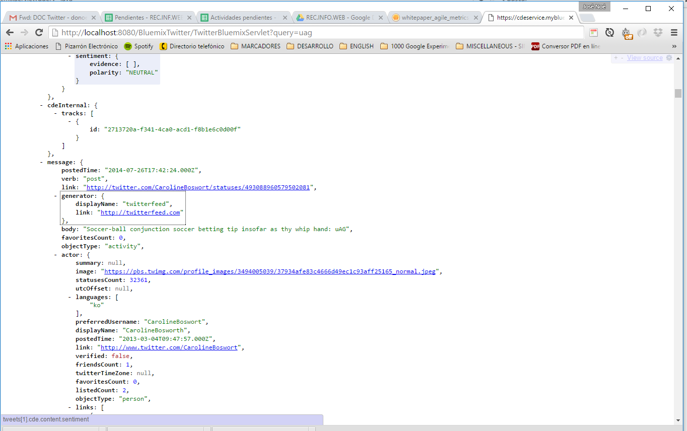

Materia: Recuperación de Información de la Web
Alumno: JOSÉ NOÉ HERNÁNDEZ VIVANCO
Número: 3024021

Proyecto de Bluemix en donde se describe como crear un traductor sencillo utilizando la Plataforma Bluemix.

## Paso 1 ##
* Ingresar a bluemix.net y autenticarse (ingresar nombre de usuario y contraseña) registrados previamente.
* Buscar la opción Panel de control y hacer clic.
* Dirigirnos a: Servicios y API, y dar clic en la opción (Utilizar servicios o API).
* localizar el Servicio: "Language Translation" y dar clic dentro de el.
* Presionar el botón "Crear servicio" y una vez creado  localizar "Credenciales del Servicio"
* Utilizar las credenciales como en el ejemplo siguiente pero para nuestro codigo.

## Paso 2 - Crear un proyecto con Netbeans  ##
* File/Archivo, clic (opciones de arriba y a la izquierda), del menú que se ha desplegado clic en: New Project/Nuevo Proyecto
* Buscar en la columna Categories la opcion Maven y a lado derecho seleccionar Web Application, luego clic en el boton Next /Siguiente. 
* En Project Name poner el nombre que sea, y hagan clic en el boton Next.
* El siguiente menú es para seleccionar en que servidor se va a ajecutar su aplicación, por defecto deberán tener seleccionado GlassFish Server, o en su defecto deberán crear y agregar el servidor (es muy fácil, prácticamente Siguiente, Siguiente...Aceptar y listo!)
* Si ya seleccionaron GlassFish hacer clic en finalizar.

## Paso 3 - Configuración de la API de Watson ##
De lado Izquierdo les aparecen 3 pestañas: Proyectos, archivos y servicios. En proyectos se muestra una lista de todos nuestros proyectos abiertos, en servicios se muestra una lista de Bases de datos, Servidores, Web Services y X repositorios. Por lo pronto solo nos interesa la pestaña proyectos. 
En la pestaña de proyectos, debe aparecer nuestro proyecto (con el nombre que le pusieron) con un icono de un mundo azul, al expandir el proyecto deben ver varias carpetas, las que nos interesan por lo pronto son: web pages, source pages, project files.
Expandimos la carpeta project files y abrimos el archivo pom.xml (archivo de configuración de maven).
Buscamos la tag <dependencies> y dentro de ella y sin borrar nada de lo que hay vamos a incluir lo siguiente:

Guardamos cambios sobre el archivo y luego directamente en el icono de nuestro proyecto (pestaña de proyectos) hacemos clic con el botón secundario del mouse para que nos despliegue las opciones, seleccionamos Build with dependencies.
Listo, ya esta configurado el proyecto.
Notas: Maven es una herramienta para la gestión y construcción de proyectos en Java, básicamente toma lo que agregamos en el archivo pom.xml, se conecta a un repositorio y descarga las dependencias que necesite, para este aspecto es análogamente a lo que hicimos con npm install en node.js

## Paso 4 - Probando nuestra aplicación ##
* Expandimos la carpeta Source Packages.
* clic con botón secundario del mouse (sobre el paquete) >> new >> Servlet, seleccionar de la categoria WEB de lado derecho buscan Servlet y aceptar o siguiente.
* Nombramos cualquier nombre de clase damos en finalizar.

Un ejemplo a continuación:

Para agregar las dependencia (con [Shift + Ctrl + i] las incluye en automático).

* Una vez hecho hecho le damos en "Clean and Build" para que vuelva a reconstruir nuestro proyecto y le damos en "Run"

Nos debera desplegar un sitio Web y dependiendo como las hayamos declarado nuestro path es el que utilizaremos, en este ejemplo sera:

Funcionando seria como sigue:

(http://localhost:8080/BluemixTranslate/TranslateBluemixServlet?frase=Hello how are you, you are very pretty)

Resultado:

--------
Soporte y dudas
--------

email: donoe1985@gmail.com

